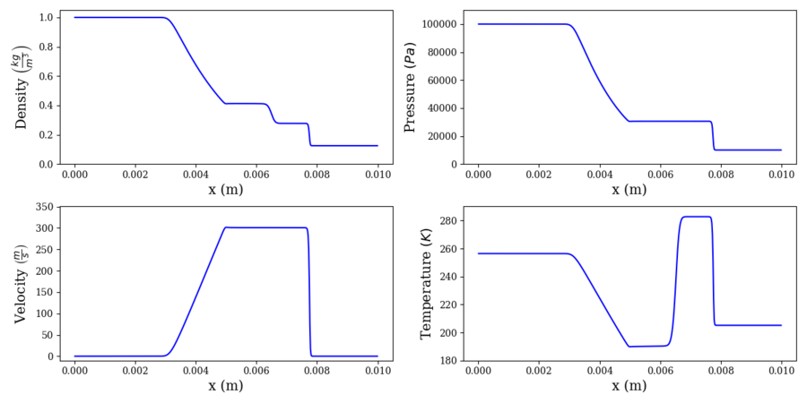
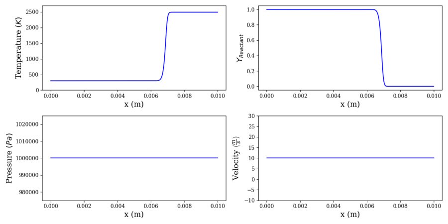
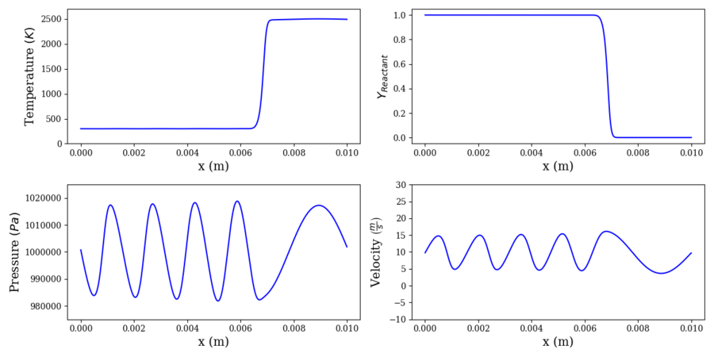
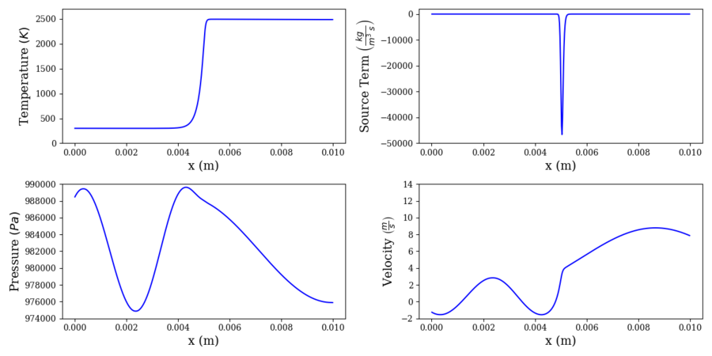

.. _examplecases-label:

Example Cases
=============

Several example cases are provided in ``perform/examples/`` to get you familiar with input file formatting and the various solver outputs. They are presented in a rough hierarchy of ROM modeling difficulty, starting from the simplest and building in difficulty by introducing additional complex physical phenomena. Ideally, new ROM methods should be tested for all problems, and their relative strengths and weaknesses in tackling each problem should be exposed in detail.

Additionally, sample ROM input files may be downloaded via ``setup_sample_rom.sh`` files included in the ``standing_flame`` and ``transient_flame`` sample case directories. After running the scripts, the ROM cases can be immediately executed with ``perform .``.

.. _sodshock-label:

Sod Shock Tube
--------------

The Sod shock tube is a classic benchmark problem. The setup of the problem models two "chambers" of gas, one at a high pressure and density and the other at a low pressure and density, separated by a diaphragm. The start of the simulation models this diaphragm instantly bursting, with a shock/contact wave combo traveling through the low-pressure gas and a rarefaction wave traveling through the high pressure gas.

This case presents a multitude of challenges for ROMs, featuring several phenomena which can be found in reacting flows, even though this case is a single-species non-reacting flow. Traditional linear subspace ROMs experience strong ringing artifacts near the shock and contact, while most static solution representations fail to propagate the waves beyond the model training period.

Transient Contact Surface
-------------------------

This case introduces a multiple chemical species (two, to be exact) configuration, featuring a low-temperature "reactant" species and a high-temperature "product" species, all at a uniform pressure and velocity. The gas's average velocity of 10 m/s propels the resulting contact surface downstream. The viscosity and reaction are turned **off** for this case.

Similarly to the Sod shock tube, this case exhibits strong gradients in temperature and species mass fraction that can be difficult for traditional linear subspace methods to capture, along with a transient wave which can be hard to propagate beyond the model training period. Frankly, this case may be even easier than the Sod shock tube, but serves as a gentle introduction to the multi-species formulation.

Contact Surface w/ Artificial Forcing
^^^^^^^^^^^^^^^^^^^^^^^^^^^^^^^^^^^^^

To introduce additional complexity to the transient contact surface case, the user may apply artificial pressure forcing at the outlet to introduce an acoustic wave propagating upstream. The differing density between the cold reactant and hot product species results in different local sounds speeds, which makes for some interesting system acoustics which can be challenging for ROMs to reproduce.

Standing Flame w/ Artificial Forcing
------------------------------------

This case is similar to the contact surface in the sense that it features a cold "reactant" species and a hot "product" species. However, the viscosity and reaction are turned **on** for this case, with a single-step irreversible reaction mechanism which simply converts "reactant" to "product". Additionally, the bulk velocity of the fluid is decreased to the point that the reaction and diffusion is perfectly balanced with the bulk velocity, resulting in an effectively stationary flame. Artificial pressure forcing is applied at the outlet, causing a single-frequency acoustic wave to propagate upstream.

This is an incredibly simple reacting flow problem, one which linear subspace ROMs should nail with only a few trial basis modes. This is not surprising, as the flow is largely stationary, with all fluctuations exhibiting a fixed frequency and amplitude. However, we've observed that non-linear autoencoder projection ROMs may fail even for this simple case, and users should take care to check whether their methods succeed.

A ``setup_sample_rom.sh`` script is also provided to download input files for a linear MP-LSVT projection ROM. Simply execute the script and the necessary input files will be unpacked, after which the ROM may be executed normally.

Transient Flame
---------------

This case exhibits all of the features of the previous test cases: a cold "reactant" species diffusing into a hot "product" species, a single-step reaction mechanism, and a higher bulk fluid velocity to cause the flame to advect downstream. The sharp gradients in temperature and species mass fraction, the stiff reaction source term, and the bulk advection of the sharp gradients make for a fairly challenging problem.

.. image:: ../images/transient_flame_without_forcing.png
  :alt: Transient flame w/o forcing profiles

A ``setup_sample_rom.sh`` script is also provided to download input files for a non-linear autoencoder MP-LSVT projection ROM via TensorFlow-Keras. Simply execute the script and the necessary input files will be unpacked, after which the ROM may be executed normally. Note that the execution of this ROM is expected to be much, much slower than that of the FOM, as deep autoencoder ROMs are notoriously computationally expensive.

Transient Flame w/ Artificial Forcing
^^^^^^^^^^^^^^^^^^^^^^^^^^^^^^^^^^^^^

The complexity of the transient flame problem may be further increased by applying artificial pressure forcing at the outlet, causing an acoustic wave to propagate upstream. As the amplitude and frequency of the forcing is increased, the interaction between the system acoustics and the flame becomes increasingly complex. 

.. image:: ../images/transient_flame_with_forcing.png
  :alt: Transient flame w/ forcing profiles

These highly non-linear interactions lie at the core of the problems the authors are working to tackle, namely the often-disastrous feedback loop between unsteady reaction heat release and system acoustics in modern combustion devices such as rocket or gas turbine combustors.