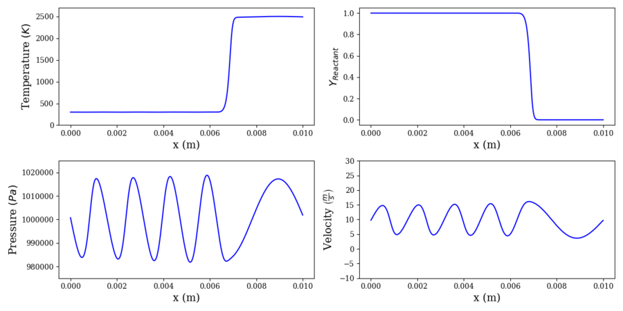

# Contact Surface

This case introduces a two-chemical-species configuration, featuring a low-temperature "reactant" species and a high-temperature "product" species, all at a uniform pressure and velocity. The gases only differ in their reference enthalpy at 0 K. The gas’s average velocity of 10 m/s propels the resulting contact surface downstream. The viscosity and reaction are turned off for this case. This case serves as a gentle introduction to the multi-species formulation.

Additional complexity and parametrization can be introduced by applying artificial pressure forcing at the outlet to produce an acoustic wave propagating upstream. The differing density between the cold reactant and hot product species results in different local sounds speeds, which makes for some interesting system acoustics. To run an example of this, simply uncomment the `pert_type_outlet`, `pert_perc_outlet`, and `pert_freq_outlet` parameters in `solver_params.inp`. You can modify the latter two parameters to change the amplitude and frequency of the forcing, respectively. Note that increasing the forcing amplitude will generally slow the implicit time integrator's convergence.

