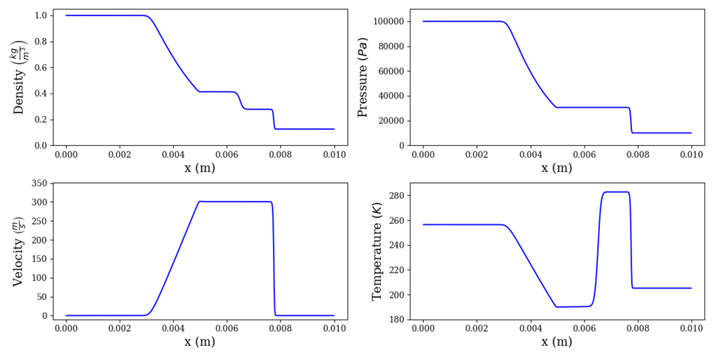

# Shock Tube

The case set up here follows the original shock tube problem of Gary A. Sod. This models two chambers of gas separated by a diaphragm. The left chamber (x <= 0.05 mm) contains a high-pressure, high-density gas, while the right chamber contains a low-pressure, low-density gas. Both chambers initially have zero velocity. The pressure ratio between the left and right chamber of 10x, while the density ratio between the left and right chamber is 8x. The start of the simulation mimics the instantaneous bursting of the diaphragm, resulting in a shock and contact wave propagating downstream into the right chamber while a rarefaction wave propagates upstream into the left chamber. Only one chemical species is modeled. 

This case can be parametrized in a couple ways. The simplest way is to change the pressure or density ratios. You can change the pressure in either chamber directly from `inputs/shock_tube.inp`, but be aware that this will obviously change the density ratio as well. You can adjust the chamber temperatures proportionately to compensate. To change the density ratio, you can change the chamber temperatures proportionately. Both changes follow easily from the ideal gas law. Alternatively, you can modify the problem into a two-species problem in which the gases in each chamber have different properties, e.g. molecular weights. Follow the inputs for `contact_surface`, `standing_flame`, or `transient_flame` to modify the problem to a multi-species configuration.