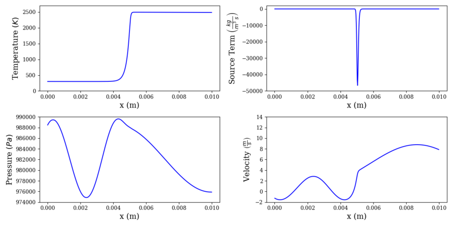

# Standing Flame

This case is similar to the contact surface in the sense that it features a cold "reactant" species and a hot "product" species. However, the viscosity and reaction are turned on for this case, with a single-step irreversible reaction mechanism which simply converts "product" to "species". Additionally, the bulk velocity of the fluid is decreased to the point that the reaction and diffusion is perfectly balanced with the bulk velocity, resulting in an effectively stationary flame. Artificial pressure forcing is applied at the outlet, causing a single-frequency acoustic wave to propagate upstream.

