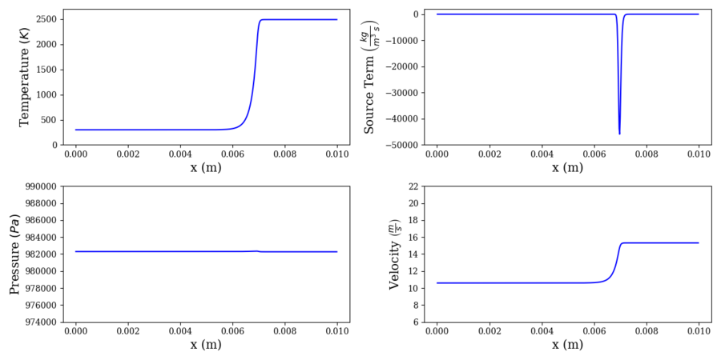
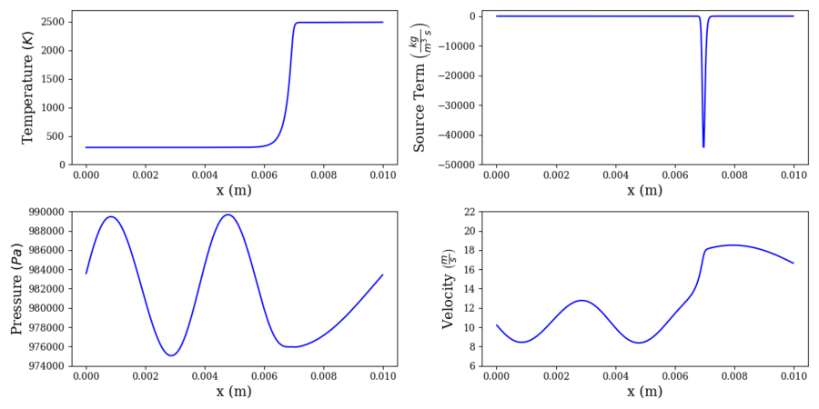

# Transient Flame

This case exhibits all of the features of the previous multi-species test cases: a cold "reactant" species diffusing into a hot "product" species, a single-step reaction mechanism, and a higher bulk fluid velocity to cause the flame to advect downstream. The sharp gradients in temperature and species mass fraction, the stiff reaction source term, and the bulk advection of the sharp gradients make for a fairly challenging problem.

As with the contact surface, the complexity of the transient flame problem may be further increased by applying artificial pressure forcing at the outlet, causing an acoustic wave to propagate upstream. As the amplitude and frequency of the forcing is increased, the interaction between the system acoustics and the flame becomes increasingly complex.

## Sample ROM Case

A Bash script, `setup_sample_rom.sh`, is provided to download files necessary to run a sample ROM simulation for the transient flame case. Simply modify the execution permissions of the script using `chmod` and execute it in the sample case working directory. The script downloads and unpacks a slightly modified `solver_params.inp` file, a `rom_params.inp` file, the initial condition profile NumPy binary, the Keras HDF5 encoder and decoder files, and the necessary feature scaling profile NumPy binaries. After the script completes, simply execute "`perform .`" to test the ROM. **You must have TensorFlow installed to run this sample ROM.**

This sample ROM is a non-linear SP-LSVT ROM using a TensorFlow-Keras autoencoder. The autoencoder is trained from snapshots 200 to 1,000 of the primitive state data generated by the sample FOM case provided, for a total of 801 snapshots. The data is centered about the initial condition and normalized using the min-max limiter. The latent dimension of the autoencoder is 3. Although the non-linear ROM does an excellent job of reconstructing the training period for such a low latent dimension (albeit with some spurious reactions in the downstream), it fails in predicting the propagation of the flame beyond the training period. This is a major challenge in ROM method development. That being said, the autoencoder ROM performs much better in reconstruction than the equivalent linear POD ROM; we leave testing the equivalent linear projection ROM to the user as an exercise.

**N.B.: It is expected that the execution of this ROM is extremely slow.** One of the major downsides of deep autoencoder ROMs is the excessive computational cost of evaluating the decoder and its Jacobian. Even for this system of only 2,048 degrees of freedom, the runtime is an order of magnitude slower than the equivalent linear projection ROM. Decreasing this cost is an active area of research.