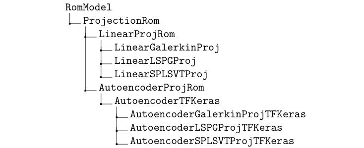

# Summary

Combusting fluid flows are common in a variety of engineering systems, driving the gas turbines which generate our electricity, providing the thrust for rocket engines, and powering our cars and airplanes. However, the use of computational fluid dynamics (CFD) to simulate these phenomena is practically impossible for time-critical, many-query applications such as parametric design, failure prediction, and uncertainty quantification. Data-driven reduced-order models (ROMs) have shown potential in vastly reducing the computational cost of evaluating CFD models. In general, ROMs learn a low-dimensional representation of the high-dimensional system state (as many as tens or hundreds of millions of degrees of freedom) and evolve this low-dimensional state in time at a much lower computational cost. Research on applying ROMs to practical reacting flows is still in its early stages, and initial results have shown that standard ROM techniques may be ineffective for this class of problems [@Huang2018;@Huang2019]. The dearth of research on this topic may be attributed to the complexity of reacting flow modeling combined with a lack of approachable open-source libraries for combustion CFD.

The Prototyping Environment for Reacting Flow Order Reduction Methods (PERFORM) is a Python packaged designed to allow rapid implementation, testing, and evaluation of ROMs for one-dimensional reacting flows. It combines a robust compressible reacting flow solver with a modular framework for deploying new ROM methods. This eliminates much of the difficulty for ROM developers who may have little experience with combustion modeling or low-level programming languages, allowing them to perform research with a challenging, practical class of problems.

# Statement of need

The ROM community spans many scientific disciplines, and efforts to build and release tools for ROM research and applications have been commensurately broad. Some open-source projects provide implementations of standard ROM methods within a specific flow solver [@ithacasem;@Stabile2017CAIM;@Stabile2017CAF;@Hesthaven2016;@acceleratecfd]. Other libraries have been developed to provide interfaces with any solver and supply ROM capabilities, most notably Pressio [@Rizzi2020] and pyMOR [@Milk2016]. These libraries allow flexibility for CFD practitioners to use a built-in or existing CFD solver and test a suite of standard ROM methods over a wide range of applications. However, these may not be useful to ROM method developers who do not have the software engineering skills to implement new ROM methods in a very complex software environment or in a low-level programming language. Further, those who wish to test ROM methods on combustion problems may not have access to a good combustion CFD solver (most are closed-source) or the know-how to use general open-source solvers such as OpenFOAM. 

PERFORM aims to overcome some of these issues by packaging a one-dimensional compressible reacting flow solver with a flexible object-oriented ROM framework. It trades flexibility of application for flexibility of ROM development, aiming to make the code extremely accessible to ROM researchers of all backgrounds. For one, PERFORM is written purely in Python, a widely-popular and easily-learned high-level programming language. Additionally, ROMs in PERFORM are structured within a class hierarchy which maximizes code re-use and minimizes developer effort in implementing variations of ROM methods. The below class hierarchy for projection-based ROMs displays this modular framework, where the lowest level classes (e.g. `LinearGalerkinProj`, `LinearLSPGProj`, `LinearSPLSVTProj`) implement two to three instance methods which differ by only a few lines of code. 

Only a basic understanding of Python classes and NumPy/SciPy operations is required to implement new ROM methods. Further, all elements of the underlying reacting flow solver are separated from the ROM classes, ensuring that ROM method developers do not need to interact with the nuances of the solver routines. As such, the learning curve for understanding PERFORM's ROM mechanics and implementing new ROM methods is extremely gentle. We note that although pyMOR [@Milk2016] similarly provides a pure Python framework, it aims to be far more generalizable to any class of problems, be compatible with a host of low-level computational and data handling libraries, and enable parallel computing, which makes prototyping and maintenance much more cumbersome. 

PERFORM's public repository comes with several benchmark cases which are ready to run out-of-the-box. As will be discussed below, these benchmark cases address several of the critical issues facing the broader ROM community, particularly the difficulty of propagating transient flow features beyond the training data set and making accurate predictions in a complex parameter space. It is the hope that by providing these benchmark cases, the community can measure and compare ROM methods for a more challenging, yet manageable, class of problems.

# Features

PERFORM is designed with modularity and expansion in mind. Generic class interfaces are provided to allow for the simple implementation of new gas models, reaction models, flux schemes, time integration schemes, and boundary conditions. Generic class interfaces are also provided for linear projection ROMs, and non-linear projection ROMs via Keras [@keras] autoencoders. Beyond this, the solver comes with many standard accessories, such as saving and initializing simulations from restart files, live visualizations of field and probe monitor data, saving field and probe monitor data and visualizations to disk, and several useful pre-/post-processing scripts.

At the time of submitting this paper, PERFORM is specifically equipped with the following features:

- calorically-perfect gas (CPG) model
- irreversible finite-rate reaction model
- Roe flux difference scheme [@Roe1981]
- several explicit Runge-Kutta time integration schemes
- implicit BDF time integration schemes, with or without dual time-stepping [@Venkateswaran1995]
- linear Galerkin (explicit and implicit) [@Rowley2004], LSPG [@Carlberg2017], and SP-LSVT [@Huang2020] projection ROMs with DEIM hyper-reduction [@]
- non-linear Galerkin (explicit and implicit), LSPG [@Lee2020], and SP-LSVT projection ROMs via Keras autoencoders

Work is ongoing to provide generic class interfaces for non-intrusive ROM methods and ROM stabilization methods (e.g. closure, filtering, artificial viscosity). A thermally-perfect gas model and reversible finite rate reaction model, as well as non-linear autoencoder ROMs via PyTorch, are also in development.

# Applications

PERFORM was created within an ongoing US Air Force Office of Scientific Research Center of Excellence collaboration between researchers from the University of Michigan, the University of Texas at Austin, New York University, and Purdue University investigating ROMs for rocket combustors. Many team members do not have intimate experience with combustion modeling, and PERFORM was originally developed for internal use by those members to test novel ROM methods on simplified combusting flows. Work has already begun in using it to compute linearized ROMs, perform basis and sampling adaptation for hyper-reduction, and compute premixed flamelet manifolds.

Recent community-wide discussions have begun encouraging ROM researchers to pursue more practical fluid flow applications. This was synthesized in the ``Data-driven Modeling for Complex Fluid Physics'' panel at the 2021 AIAA SciTech Forum, where leaders in the ROM community discussed a general need to evaluate ROMs beyond the traditional "toy" problems (e.g. 1D Burgers', 2D lid-driven cavity). PERFORM was presented as a companion code to this workshop, and provides several benchmark cases for use in future meetings of the workshop. These benchmark cases include a Sod shock tube, a transient multi-species contact surface (with and without artificial acoustic forcing), a stationary premixed flame (with artificial acoustic forcing), and a transient premixed flame (with and without artificial acoustic forcing). These benchmarks are intended to provide some cohesion for the ROM community to address more complex, practical systems.

# Acknowledgements

The authors acknowledge support from the US Air Force Office of Scientific Research through the Center of Excellence Grant FA9550-17-1-0195 (Technical Monitors: Fariba Fahroo, Mitat Birkan, Ramakanth Munipalli, Venkateswaran Sankaran).

We thank Ashish Nair, Cheng Huang, Nicholas Arnold-Medabalimi, Elnaz Rezaian, and Sahil Bhola for their help in stress-testing PERFORM and providing valuable discussion on its development, especially in its early stages.

# References